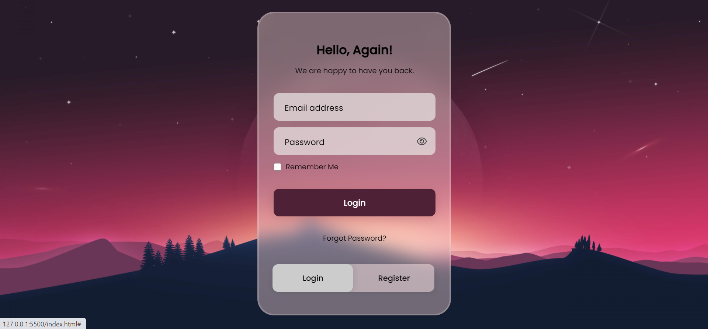
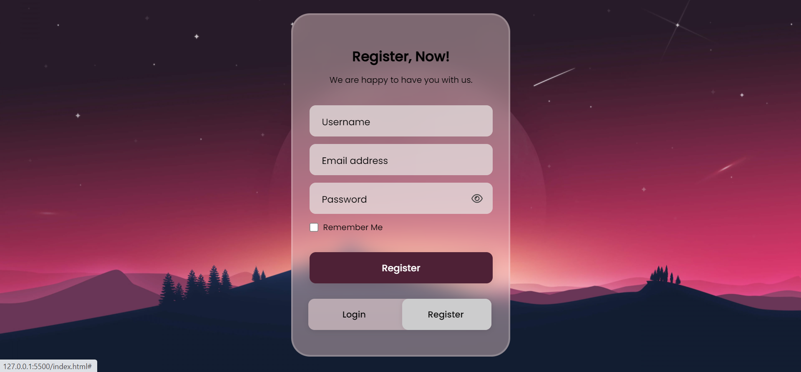

# Animated Login & Register System - CodeX

A simple and stylish login and registration forms implemented in HTML and CSS. This project provides a user-friendly interface for users to login or register on your website.

## Description

This project is a login and registration system designed with a clean and modern user interface. It offers user-friendly login and registration forms, password visibility toggling, and a remember me option. The design is responsive and adapts to different screen sizes.

## Features

- Fluid animation for switching between login and register forms
- User-friendly login and registration interfaces
- Password visibility toggle for enhanced user experience
- Stylish switch for effortless navigation
- Remember me option to save user preferences

## Screenshots

## Usage

1. Download the zip file, and open it in visual studio code.
2. Open the index.html file in your web browser.
3. Explore the login and registration forms, toggle password visibility, and test the user interface

©Pradeep_V (CodeX)
